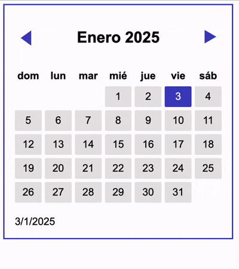

# ReactJS Calendar Component

A customizable and reusable calendar component built in ReactJS. This component is designed to handle date selection and styling dynamically, making it a perfect addition to any project requiring date management.

## Features

- **Dynamic date display:** It adjusts to show the correct days for any given month and year.
- **Locale adaptation:** It is configured to display day headers in the user's locale.
- **Customizable styles:** It allows to easily modify the appearance of calendar cells and selected dates.
- **Responsive design:** It ensures a seamless user experience across devices.

## Preview



## Installation

1. Clone this repository:

```[bash]
git clone https://github.com/abrilherrada/reactjs_calendar-component.git
```

2. Navigate to the project directory:

```[bash]
cd reactjs_calendar-component
```

3. Install dependencies:

```[bash]
npm install
```

4. Start the development server:

```[bash]
npm start
```

## Usage

To integrate the calendar component into your project:

1. Import the component:

```[javascript]
import Calendar from './path-to-calendar/Calendar';
```

2. Use the component in your JSX:

```[javascript]
function App() {
    return (
        <div className="App">
            <Calendar />
        </div>
    );
}
```

## Customization

You can customize the calendar by modifying the component's styles in the corresponding stylesheet.

## Contributing

Contributions are welcome! If you have suggestions or find a bug, please open an issue or submit a pull request.

## License

This project is licensed under the MIT License.
